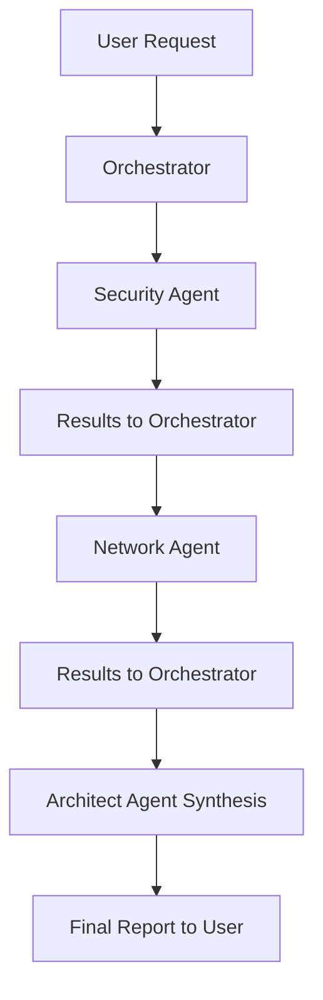
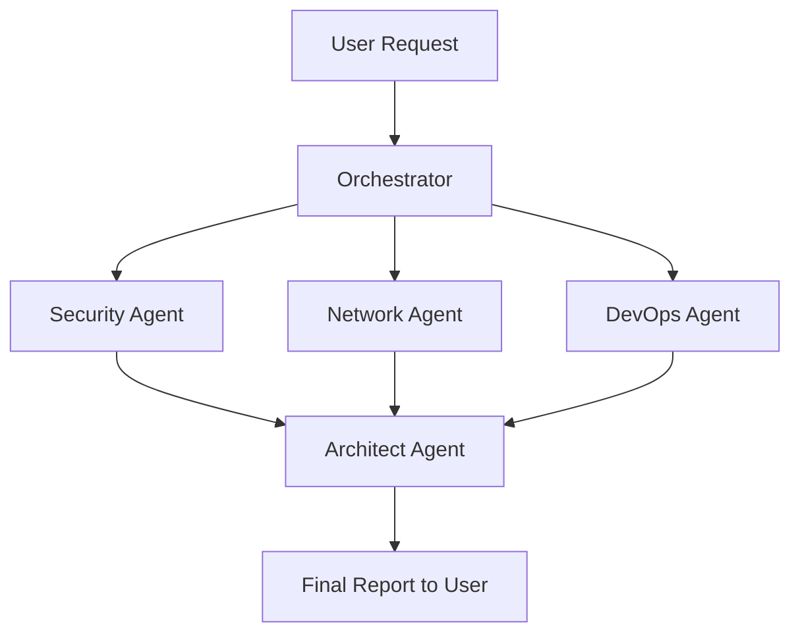
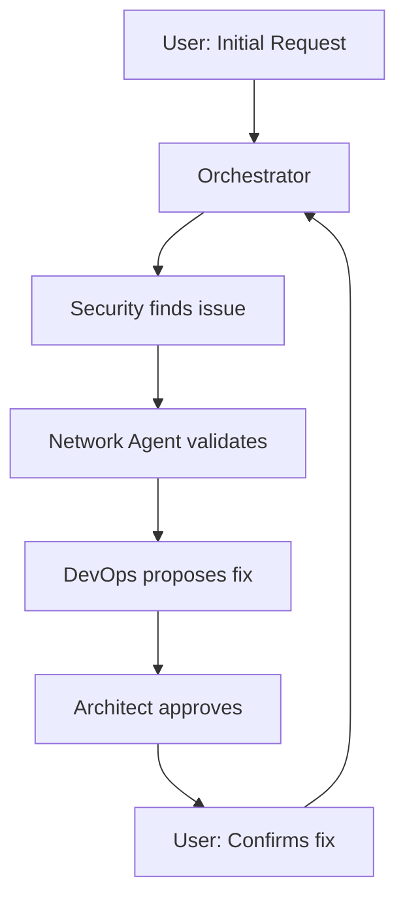

# Multi-Agent Architecture for FSI Landing Zone

## Overview

The Multi-Agent Squad architecture uses **specialized AI agents** that collaborate to provide expert-level analysis and recommendations across multiple domains (DevOps, Security, Network, Architecture).

---

## 🏗️ Architecture Diagram

```
┌─────────────────────────────────────────────────────────────┐
│                    USER INTERACTION                          │
└────────────────────────┬────────────────────────────────────┘
                         │
                         ▼
          ┌──────────────────────────────┐
          │   ORCHESTRATOR AGENT          │
          │   (Coordinator)               │
          │                               │
          │   • Routes requests           │
          │   • Coordinates specialists   │
          │   • Consolidates results      │
          └───────────┬───────────────────┘
                      │
        ┌─────────────┼─────────────┬────────────┐
        │             │             │            │
        ▼             ▼             ▼            ▼
  ┌─────────┐   ┌──────────┐  ┌─────────┐  ┌──────────┐
  │ DevOps  │   │ Security │  │ Network │  │Architect │
  │ Agent   │   │ Agent    │  │ Agent   │  │ Agent    │
  └─────────┘   └──────────┘  └─────────┘  └──────────┘
        │             │             │            │
        └─────────────┴─────────────┴────────────┘
                      │
                      ▼
            ┌─────────────────────┐
            │   SHARED TOOLS      │
            │   • Read            │
            │   • Bash (Azure CLI)│
            │   • Grep/Glob       │
            │   • Custom Tools    │
            └─────────────────────┘
```

---

## 👥 Agent Roles

### 🎯 **Orchestrator Agent**
**Role:** Coordinator and traffic controller

**Responsibilities:**
- Receives user requests
- Determines which specialists to invoke
- Coordinates parallel analysis
- Consolidates multi-agent responses
- Provides final synthesis to user

**Example:**
```
User: "Review my entire deployment"
Orchestrator:
  1. Invokes Security Agent → Security analysis
  2. Invokes Network Agent → Network analysis
  3. Invokes DevOps Agent → CI/CD analysis
  4. Invokes Architect Agent → Synthesizes all inputs
  5. Returns consolidated report to user
```

---

### 🚀 **DevOps Specialist Agent**
**Role:** CI/CD and deployment automation expert

**Expertise:**
- Azure DevOps / GitHub Actions pipelines
- Deployment scripts (deploy.sh, Bicep automation)
- Infrastructure testing and validation
- Rollback strategies
- GitOps workflows

**Tools:**
- `analyze_deployment_scripts` - Reviews deploy.sh, pipelines
- `review_pipeline_security` - Checks for secrets, approval gates
- `check_rollback_capability` - Validates rollback mechanisms
- `validate_cicd_configuration` - FSI compliance checks

**When Invoked:**
- Ring 1 (Platform) deployment reviews
- CI/CD pipeline analysis
- Deployment script optimization
- Rollback strategy validation

---

### 🔒 **Security Specialist Agent**
**Role:** Compliance and security hardening expert

**Expertise:**
- GDPR, DORA, PSD2, MiFID II, EBA Guidelines
- Azure Policies and governance
- Key Vault, encryption, secrets management
- Network Security Groups (NSG)
- Entra ID, PIM, Conditional Access

**Tools:**
- `audit_key_vault_security` - Reviews Key Vault config (purge protection, RBAC, etc.)
- `analyze_nsg_rules` - Detects vulnerable NSG rules
- `check_compliance_policies` - Maps to GDPR/DORA/PSD2
- `validate_encryption_config` - Checks encryption at rest/in transit
- `review_iam_configuration` - Reviews Entra ID, PIM, RBAC

**When Invoked:**
- Ring 0 (Foundation) security reviews
- Compliance validation (pre-PROD)
- Security audit before go-live
- Policy enforcement checks

---

### 🌐 **Network Specialist Agent**
**Role:** Network architecture and connectivity expert

**Expertise:**
- Hub-spoke topology
- Azure Firewall configuration
- VPN Gateway / ExpressRoute
- Private endpoints and Private Link
- VNet peering and routing
- DNS configuration

**Tools:**
- `analyze_network_topology` - Reviews hub-spoke design
- `review_firewall_rules` - Validates Azure Firewall policies
- `check_private_endpoints` - Ensures PaaS uses Private Link
- `validate_routing_tables` - Reviews UDRs and BGP

**When Invoked:**
- Ring 0 + Ring 2 network reviews
- Connectivity troubleshooting
- Firewall rule optimization
- Network segmentation validation

---

### 🏗️ **Architect Specialist Agent**
**Role:** Solution architect - synthesis and best practices

**Expertise:**
- Overall architecture design
- Cross-domain synthesis (Security + Network + DevOps)
- Best practices enforcement
- Cost optimization
- Scalability and resilience
- Trade-off analysis

**Tools:**
- `synthesize_analysis` - Consolidates multi-agent findings
- `recommend_improvements` - Prioritized action items
- `estimate_costs` - Cost analysis per ring
- `assess_scalability` - Future-proofing recommendations

**When Invoked:**
- Always invoked AFTER other specialists
- Provides final synthesis
- Identifies cross-domain issues (e.g., security + network conflicts)
- Prioritizes remediation

---

## 🔄 Collaboration Patterns

### Pattern 1: Sequential Review



**Use Case:** When agents need results from previous agents

**Example:** Network Agent needs to know which Key Vaults exist (from Security Agent)

---

### Pattern 2: Parallel Analysis (Preferred)



**Use Case:** When agents can work independently

**Example:** "Review entire deployment" - each agent analyzes their domain in parallel

**Benefit:** 2-3x faster than sequential

---

### Pattern 3: Iterative Refinement



**Use Case:** Complex issues requiring collaboration

**Example:** "Port 22 open" (Security) → "Needed for Bastion?" (Network) → "Use Azure Bastion instead" (DevOps) → "Approved" (Architect)

---

## 🔧 Tool Sharing

All agents have access to shared tools:

### **Read** - Read local files
```python
# Each agent can read templates
Read(file_path="ring0_foundation/key-vault.bicep")
```

### **Bash** - Execute Azure CLI commands
```python
# Check deployed state
Bash(command="az keyvault show --name <vault-name>")
```

### **Grep/Glob** - Search codebase
```python
# Find all NSG templates
Glob(pattern="**/*nsg*.bicep")
```

---

## 📊 Example Multi-Agent Workflow

### User Request: "Review my Ring 0 deployment for production readiness"

#### Step 1: Orchestrator Analyzes Request
```
Orchestrator: "Ring 0 review requires Security + Network analysis"
Decision: Invoke Security Agent + Network Agent in parallel
```

#### Step 2: Security Agent Analysis
```
Security Agent:
  1. Reads: key-vault.bicep, azure-policies.bicep, nsg.bicep
  2. Runs: az keyvault show, az policy state list
  3. Checks: GDPR, DORA, PSD2 compliance

Findings:
  ✅ Key Vault: Purge protection enabled
  ✅ Policies: GDPR initiative applied
  ❌ CRITICAL: Diagnostic settings missing (GDPR requirement)
  ⚠️  NSG: Port 22 open to 0.0.0.0/0

Returns to Orchestrator: Security report
```

#### Step 3: Network Agent Analysis (Parallel)
```
Network Agent:
  1. Reads: hub-vnet.bicep, azure-firewall.bicep
  2. Runs: az network vnet show, az network firewall list
  3. Checks: Hub-spoke topology, firewall rules

Findings:
  ✅ Hub-Spoke: Correctly configured
  ✅ VNet Peering: Functional
  ⚠️  Firewall: Only 2 rules defined
  ⚠️  No VPN Gateway (ExpressRoute recommended for PROD)
  ❌ NSG: Port 22 allows internet access

Returns to Orchestrator: Network report
```

#### Step 4: Architect Synthesis
```
Architect Agent:
  Receives: Security report + Network report

  Cross-Domain Analysis:
    • NSG port 22 flagged by BOTH Security + Network → HIGH PRIORITY
    • Diagnostic settings missing → COMPLIANCE BLOCKER
    • Firewall under-configured → MEDIUM PRIORITY

  Synthesis:
    📊 Production Readiness: 6/10 (Not Ready)

    🔴 BLOCKERS (Must fix before PROD):
      1. Close NSG port 22 (use Azure Bastion instead)
      2. Enable Key Vault diagnostic settings (GDPR)

    🟡 RECOMMENDED (Should fix):
      3. Add more firewall rules (define allowed traffic)
      4. Consider VPN Gateway or ExpressRoute

    💡 Timeline: 2-3 days to resolve blockers

Returns to Orchestrator: Prioritized action plan
```

#### Step 5: Orchestrator Consolidation
```
Orchestrator: Combines all reports into single response

Final Report to User:
  🏗️  Ring 0 Production Readiness Assessment

  Overall Score: 6/10 (NOT READY FOR PRODUCTION)

  [Security Agent Findings]
  [Network Agent Findings]
  [Architect Synthesis with prioritized action items]

  ⏭️ Next Steps:
    1. Fix NSG port 22 exposure immediately
    2. Enable Key Vault diagnostics
    3. Review firewall rules
    4. Re-run this review after fixes
```

---

## 🎯 Benefits of Multi-Agent Architecture

### 1. **Deep Expertise**
- Each agent is an expert in their domain
- Specialized system prompts for maximum quality
- Focused tools for specific analyses

### 2. **Parallel Processing**
- Multiple agents work simultaneously
- 2-3x faster for complex reviews
- Better resource utilization

### 3. **Cross-Domain Insights**
- Architect agent identifies conflicts between domains
- Example: Security requires private endpoints + Network validates connectivity

### 4. **Scalability**
- Easy to add new specialists (Cost Optimization Agent, Compliance Agent, etc.)
- Agents are independent and loosely coupled
- Can scale individual agents based on workload

### 5. **Separation of Concerns**
- Each agent maintains its own context
- Easier to maintain and improve
- Clear responsibility boundaries

### 6. **Quality Assurance**
- Multiple agents cross-check findings
- Architect agent validates consistency
- Reduces false positives

---

## 🚀 Future Enhancements

### Planned Features:
1. **Cost Optimization Agent** - Analyzes costs, suggests optimizations
2. **Compliance Agent** - Dedicated GDPR/DORA/PSD2 validation
3. **Performance Agent** - Reviews scalability, performance bottlenecks
4. **Agent Memory** - Agents remember previous conversations
5. **Auto-Remediation** - Agents propose and apply fixes
6. **Custom Specialist Creation** - Users can create their own specialist agents

---

## 📚 See Also

- [COMPARISON.md](./COMPARISON.md) - Mono vs Multi-Agent comparison
- [QUICKSTART-RINGS.md](./QUICKSTART-RINGS.md) - Getting started guide
- [RING-ARCHITECTURE.md](./RING-ARCHITECTURE.md) - Ring deployment strategy

---

**TL;DR**: Multi-agent squad = team of specialists working together for comprehensive FSI Landing Zone analysis. Each agent is an expert, they work in parallel, and the Architect synthesizes everything. 🎯
